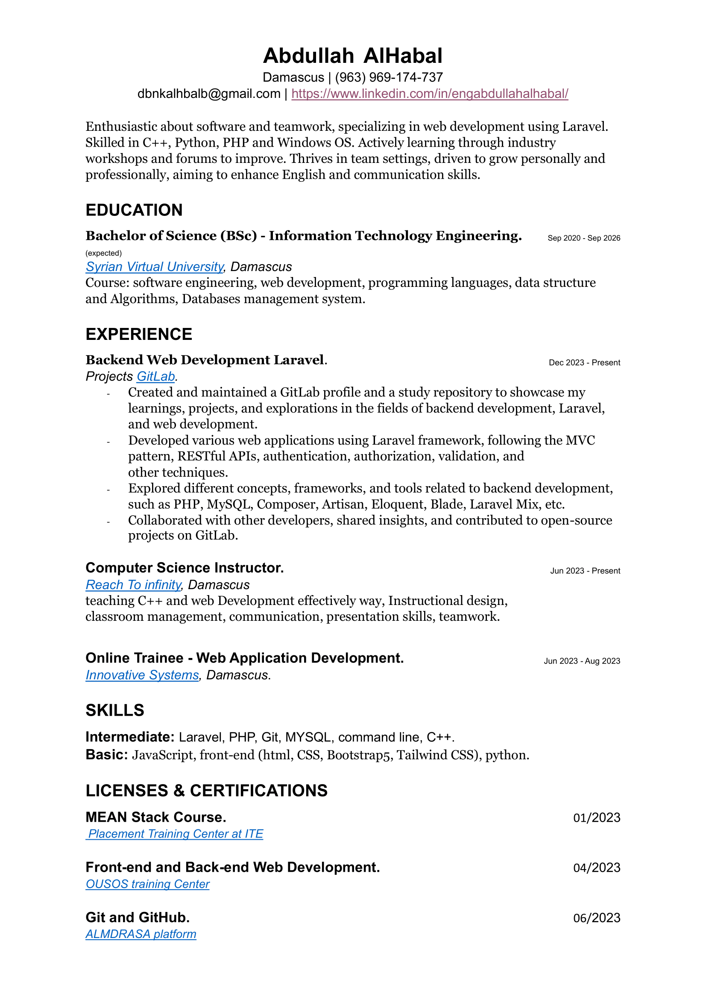

# Abdullah Alhabal's Study Repository

## Introduction
Welcome to my study repository! I'm Abdullah Alhabal, a Software Engineering student passionate about backend development, Laravel, and web development. This repository serves as a collection of my learnings, projects, and explorations in these fields.

## About Me
I'm Abdullah, a dedicated learner in the realm of Software Engineering. My enthusiasm lies in understanding the intricacies of backend development, mastering Laravel, and delving into various aspects of web development.

## Study Focus
- **Backend Development:** Exploring different concepts, frameworks, and tools.
- **Laravel:** Diving deep into Laravel, building projects, and understanding its ecosystem.
- **Web Development:** Exploring front-end technologies to complement my backend skills.

## Future Goals
I aspire to evolve as a well-rounded Software Engineer, adept in crafting robust backend solutions. My future goals include contributing to open-source projects, expanding my knowledge in cloud technologies, and mastering full-stack development.

## Contributions
I'm open to collaborations, discussions, and contributions within the tech community. Feel free to reach out, share insights, or collaborate on projects.

## Contact Information
Connect with me on:
- **Email**: [mail me](mailto:dbnkalhbalb@gmail.com) .
- **LinkedIn** : [Abdullah AlHabal](https://www.linkedin.com/in/engabdullahalhabal/) .
- **WebSite** : [Abdullah's Website](http://abdullah.infinityfreeapp.com/) .
- **Bio Links** : [Abdullah's Bio Links](https://abdullahalhbal.bio.link/) .

## EXPLORE MY RESUME 
[Resume click to download .](./Abdullah%20AlHabal%20Resume.pdf)

## Social Connect
Feel free to connect with me on various platforms:
- **GitLab** : [gitlab](https://gitlab.com/AbdullahAlhabal).
- **dev** : [dev](https://dev.to/abdullahsupernova94).
- **medium** : [medium](https://medium.com/@dbnkalhbalb).
- **codepen** : [codepen](https://codepen.io/Supernova94).
- **twitter** : [twitter](https://twitter.com/abood_iteng).
- **leetcode** : [leetcode](https://linkedin.com/in/engabdullahalhabal).
- **LinkedIn** : [LinkedIn](https://leetcode.com/supernova94/).
- **hackerearth** : [hackerearth](https://www.hackerearth.com/@abdullah287).
- **geeksforgeeks** : [geeksforgeeks](https://auth.geeksforgeeks.org/user/dbnkalhbalb).
- **topcoder** : [topcoder](https://profiles.topcoder.com/abdullahalhbal).
- **codechef** : [codechef](https://www.codechef.com/users/peackyblinders).
- **discord** : [discord](https://discord.gg/QtbCxTR54T).
- **stackoverflow** : [stackoverflow](https://stackoverflow.com/users/15331688/abdullah-alhabal).
- **facebook** : [facebook](https://www.facebook.com/profile.php?id=100025366722156).
- **codeforces** : [codeforces](https://codeforces.com/profile/AbdullahAlHabal).

## Formatting
This README.md is formatted using Markdown to ensure easy readability, clarity, and organization of information.

Feel free to explore my repository and join me in this exciting journey of learning and growth in Software Engineering!
